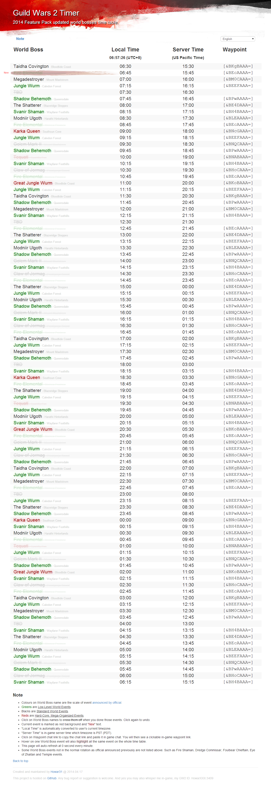
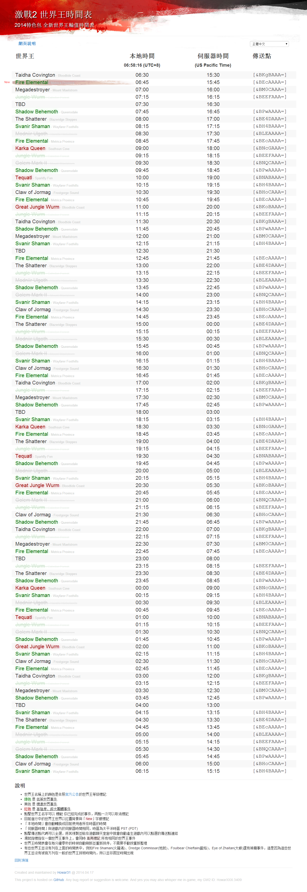

# GW2 Timer #
*2014 Feature Pack updated world bosses time table.*

GW2 Timer: [http://howar31.github.io/GW2Timer/](http://howar31.github.io/GW2Timer/)

-

> Feature:  
> * [Official World Boss time table](https://www.guildwars2.com/en/news/the-megaserver-system-world-bosses-and-events/) sorted by uptime.
> * Current active World Boss stay on top. (2 last events will be on top)
> * Timezone conversion, showing local time and server time.
> * Auto refresh page. (on 0 second every minute)
> * Highlight World Boss name with color accroding to World Boss scale.
> * Click on World Boss name to cross off the World Boss event which has already done.
> * Event map name is shown aside the World Boss name.
> * Waypoint chatlink with one-click selection.
> * Highlight all the same World Boss event at the same time while hovering.
> * Multi-languange support.  
>   * Currently support English, French(Thanks to nmss) and Traditional Chinese.
>   * Webpage will remember which language you choose last time. No need to re-select everytime you visit the webpage.
>   * If you would like to contribute additional language translation, feel free to fork the project on Github and send me pull request. Or just simply send me plain text translation and I'll make it online!
> * Note for webpage illustration

Due to 2014 Feature Pack update on April 15, 2014, most of the World Bosses now show up in specific time.  I want a neat and clean and simple time table to track the World Boss event so I created this webpage.  Hope you like it. :D

Any bug report or suggestion is welcome.  And yes you may also whisper me in-game, my GW2 ID: HowarXXXI.3409

-

> 特色功能:
> * [官方世界王時間表](https://www.guildwars2.com/en/news/the-megaserver-system-world-bosses-and-events/)，依時間排序
> * 目前世界王置頂 (目前和前一個兩個事件會置頂)
> * 依照使用者當前時區自動轉換時間
> * 自動刷新頁面，每分鐘零秒的時候會刷新頁面
> * 依照官方公告世界王等級區分標記顏色
> * 點擊世界王名稱可標記已打過的世界王
> * 顯示世界王事件地圖名稱
> * 世界王傳送點代碼，可直接複製貼在遊戲聊天頻道使用
> * 滑鼠指向某世界王時，所有相同世界王事件會同時高亮標記顯示
> * 多語言支援上線
>   * 目前支援英文、法文與正體中文
>   * 網頁會自動記住你選擇的語言，不需要每次重新選擇
>   * 如果想提供其他語言翻譯，歡迎直接在GitHub上fork這個專案並給我pull request，或是直接給我純文字翻譯，我會幫你把它放上網頁！
> * 網頁功能說明

2014 Feature Pack更新後，大部分世界王都改成打卡排班制，我想要一個簡單方便的時間表可以參考，所以自己做了這個網頁，希望大家會喜歡 :D

歡迎任何錯誤回報或建議，當然也可以在遊戲中直接密語我，我的GW2 ID: HowarXXXI.3409
